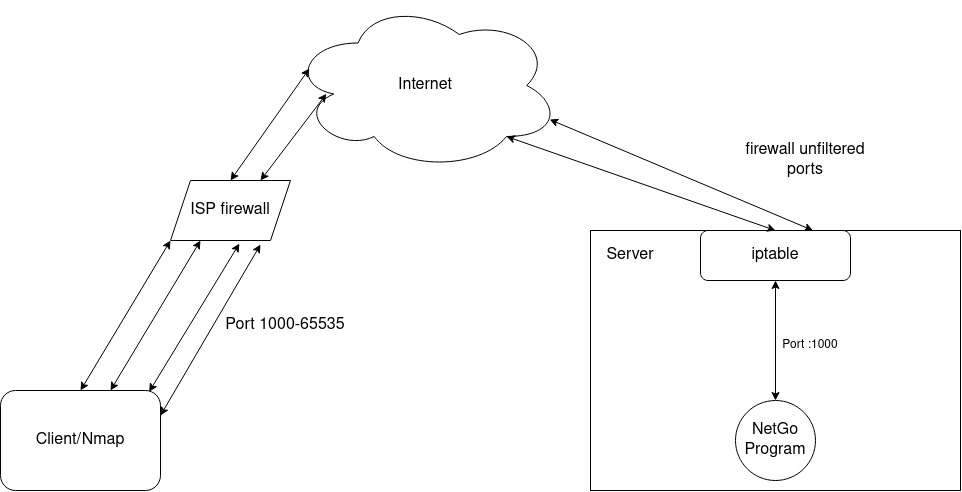

# Net-Go Server

### Golang literal port listener, do nothing other than listening port.
<hr>

### Main intention is to find open ports from firewall of ISP through internet.
<hr>

Run this program on public server with no firewall and forward all server ports to specific program port.

On server: 

```
iptables -A PREROUTING -t nat -i <server_adapter_name> -p tcp --match multiport --dports <start_port>:<end_port> -j DNAT --to <server_ip_address>:<program_listen_port>

iptables -A FORWARD -p tcp -d <server_ip_address> --match multiport --dports <start_port>:<end_port> -j ACCEPT
```

Example:

```
iptables -A PREROUTING -t nat -i ens0 -p tcp --match multiport --dports 1001:65535 -j DNAT --to 209.58.180.12:1000

iptables -A FORWARD -p tcp -d 209.58.180.12 --match multiport --dports 1001:65535 -j ACCEPT
```

### !! Warning: Avoid server SSH port

<hr>

Then scan with nmap or something to find open ports through ISP firewall. 




```
#./server -h
Usage of ./server:
  -a string
        Listen address & port (default "0.0.0.0:1000")
  -d    Run background (default "false")
  -t string
        Protocol type (default "tcp4")
```
*Run as root for UDP.

<hr>
P.S. Only support TCP & UDP package types. 

## !!! Warning: DO NOT USE THIS ON PORDUCTION SERVER AND USE WITH CAUTION.